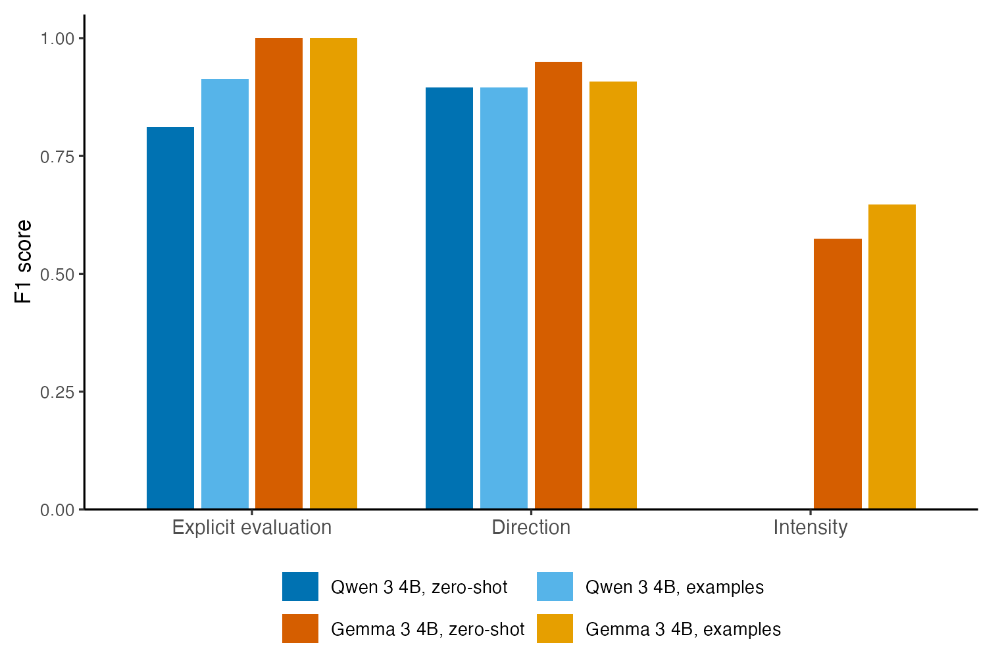
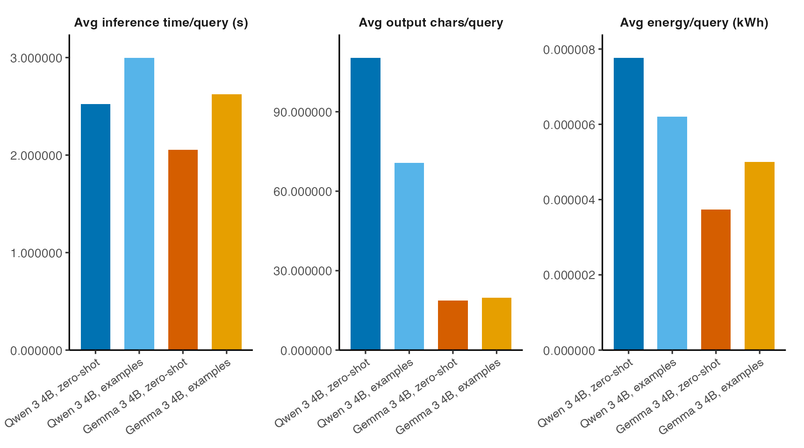

A worked, end-to-end run on the bundled `policy-sentiment` task: get the data,
run a model, read the row-level output, score it against the human labels, and
compare multiple configurations. Everything here works against the task shipped
with the package, so you can follow along before plugging in your own data.

## The policy-sentiment task

`policy-sentiment` asks four questions about short political texts, one of each
annotation type:

| Field | Type | Values |
|---|---|---|
| `Policy Sentiment_Explicit evaluation` | checkbox | `1` / `0` |
| `Policy Sentiment_Direction` | dropdown | positive · negative · mixed · no clear sentiment |
| `Policy Sentiment_Intensity` | Likert | `1`–`5` |
| `Policy Sentiment_Evidence` | textbox | short free text |

The `ground-truth.csv` holds the human labels in those columns, plus metadata
(`doc_id`, `title`, `topic`, `speaker_type`) and the `text` to annotate.

## 1. Get the task

Copy the bundled task into a local folder you control:

```python
from codebook_lab import copy_example_task

copy_example_task("policy-sentiment", "tasks")
```

This writes `tasks/policy-sentiment/codebook.json` and
`tasks/policy-sentiment/ground-truth.csv`.

## 2. Run one experiment

```python
from codebook_lab import ExperimentSpec, run_experiment

result = run_experiment(
    ExperimentSpec(
        task="policy-sentiment",
        model="gemma3:270m",
        use_examples=False,
        prompt_type="standard",
        process_textbox=True,
        country_iso_code="IRL",
    ),
    task_root="tasks",
)

print(result.experiment_directory)
print(result.metrics.summary_text)
```

Lab strips the human label columns before prompting, runs the model on each row,
writes the outputs to a timestamped directory, and scores the predictions
against the held-out labels.

## 3. Inspect the row-level output

`output.csv` keeps the metadata and text, with the model's predictions in the
same annotation columns (illustrative):

| doc_id | Policy Sentiment_Explicit evaluation | Policy Sentiment_Direction | Policy Sentiment_Intensity | Policy Sentiment_Evidence |
|---|---|---|---|---|
| ps_001 | 1 | positive | 5 | "sensible compromise" |
| ps_002 | 1 | negative | 2 | "financing assumptions are unrealistic" |
| ps_003 | 0 | no clear sentiment | 3 | "" |

Because the columns match the codebook, you can merge `output.csv` back against
`ground-truth.csv` on `doc_id` to inspect individual disagreements.

## 4. Read the metrics

`result.metrics.summary_text` prints a quick overview, and the full results land
in the tidy metrics tables under `outputs/metrics/` (illustrative):

```text
outputs/metrics/policy-sentiment_metrics_log.csv
```

| run_id | column | metric | value |
|---|---|---|---|
| run_a1b2 | Policy Sentiment_Direction | f1_macro | 0.71 |
| run_a1b2 | Policy Sentiment_Direction | percentage_agreement | 0.80 |
| run_a1b2 | Policy Sentiment_Intensity | quadratic_kappa | 0.66 |
| run_a1b2 | Policy Sentiment_Evidence | norm_levenshtein | 0.52 |

The companion `policy-sentiment_metrics_log_runs.csv` carries one row per run
with the model, prompt, and sampling configuration alongside runtime, character
counts, energy, and emissions — joined back to the metrics via `run_id`. See
[Outputs & Metrics](outputs-metrics.qmd) for the full field list and guidance on
[choosing metrics](outputs-metrics.qmd#choosing-metrics).

## 5. Compare configurations

The point of CodeBook Lab is comparison. Because the codebook and labels stay
fixed, you can isolate one variable at a time -- here, model choice and
zero-shot versus few-shot prompting.

This example runs the full 20-row bundled task with two recent 4B local models:
`qwen3:4b` and `gemma3:4b`. It disables textbox generation so the benchmark
focuses on the checkbox, dropdown, and Likert fields while still using the real
metrics and efficiency pipeline. The code below assumes the models are already
available locally in Ollama. If needed, run `ollama pull qwen3:4b` and
`ollama pull gemma3:4b` first.

```python
from codebook_lab import ExperimentSpec, copy_example_task, run_experiment

copy_example_task("policy-sentiment", "tasks")

specs = [
    ExperimentSpec(
        task="policy-sentiment",
        model="qwen3:4b",
        use_examples=False,
        reasoning=False,
        process_textbox=False,
        country_iso_code="IRL",
    ),
    ExperimentSpec(
        task="policy-sentiment",
        model="qwen3:4b",
        use_examples=True,
        reasoning=False,
        process_textbox=False,
        country_iso_code="IRL",
    ),
    ExperimentSpec(
        task="policy-sentiment",
        model="gemma3:4b",
        use_examples=False,
        process_textbox=False,
        country_iso_code="IRL",
    ),
    ExperimentSpec(
        task="policy-sentiment",
        model="gemma3:4b",
        use_examples=True,
        process_textbox=False,
        country_iso_code="IRL",
    ),
]

for spec in specs:
    run_experiment(
        spec,
        task_root="tasks",
        output_root="outputs",
        pull_model=False,
    )
```

Each run appends to the same two linked metrics tables:

```python
import pandas as pd

metrics = pd.read_csv("outputs/metrics/policy-sentiment_metrics_log.csv")
runs = pd.read_csv("outputs/metrics/policy-sentiment_metrics_log_runs.csv")

joined = metrics.merge(runs, on="run_id")

field_f1 = joined[
    (
        joined["column"].isin(
            [
                "Policy Sentiment_Explicit evaluation",
                "Policy Sentiment_Direction",
                "Policy Sentiment_Intensity",
            ]
        )
    )
    & (joined["metric"] == "f1")
]

efficiency = runs[
    [
        "run_id",
        "model_id",
        "use_examples",
        "n_queries",
        "avg_inference_time_per_query_s",
        "avg_output_chars_per_query",
        "avg_energy_kwh_per_query",
    ]
]
```

These are real figures from the full benchmark, run locally with Ollama on an
Apple M2. Your exact numbers will vary by machine, model build, and model
response validity. The plots are produced from the joined tables with `ggplot2`
and `theme_classic()`.

| Run | Explicit evaluation F1 | Direction F1 | Intensity F1 |
|---|---:|---:|---:|
| Qwen 3 4B, zero-shot | 0.812 | 0.896 | 0.000 |
| Qwen 3 4B, examples | 0.913 | 0.896 | 0.000 |
| Gemma 3 4B, zero-shot | 1.000 | 0.949 | 0.575 |
| Gemma 3 4B, examples | 1.000 | 0.908 | 0.647 |

{fig-alt="Grouped bar chart showing field-level F1 for Qwen 3 4B and Gemma 3 4B, each run zero-shot and with examples, across explicit evaluation, direction, and intensity." fig-cap="Performance comparison from the joined metrics and runs tables."}

| Run | Avg seconds/query | Avg output chars/query | Avg energy/query (kWh) |
|---|---:|---:|---:|
| Qwen 3 4B, zero-shot | 2.52 | 110 | 0.00000777 |
| Qwen 3 4B, examples | 3.00 | 71 | 0.00000620 |
| Gemma 3 4B, zero-shot | 2.06 | 19 | 0.00000373 |
| Gemma 3 4B, examples | 2.62 | 20 | 0.00000500 |

{fig-alt="Three-panel bar chart comparing average inference time per query, average output characters per query, and average energy consumption per query for the same four runs." fig-cap="Per-query efficiency comparison from the runs table."}

The tradeoff is visible: `qwen3:4b` scores well on explicit evaluation and
direction, but in this run it did not return valid Likert values for intensity,
which triggered retries and raised the query count to 80. `gemma3:4b` completed
the same task in 60 model calls and handled all three scored fields. Adding
examples improved Qwen's explicit-evaluation F1 and Gemma's intensity F1, but it
also increased average inference time and prompt size.

The CSVs used for the tables and plots are included with these docs:

- [Field-level F1 metrics](data/policy-sentiment-comparison-field-f1.csv)
- [Run configuration and efficiency metrics](data/policy-sentiment-comparison-runs.csv)

The important pattern is the same for larger benchmarks: join on `run_id`, pick
the field and metric you care about, then compare those values against the run
configuration and efficiency columns.

## Next steps

- [Tasks](tasks.qmd) — the `codebook.json` / `ground-truth.csv` format for your own data.
- [Annotation Types](annotation-types.qmd) — checkbox, dropdown, Likert, textbox, and span fields.
- [Experiments](experiments.qmd) — single runs, sweeps, custom prompt wrappers, and running without ground truth.
- [CodeBook Studio](studio.qmd) — designing a codebook and annotating in the browser.
